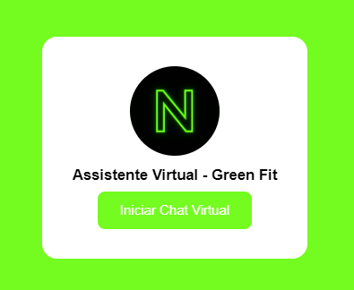
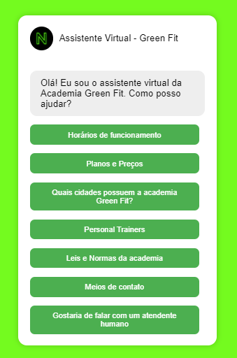
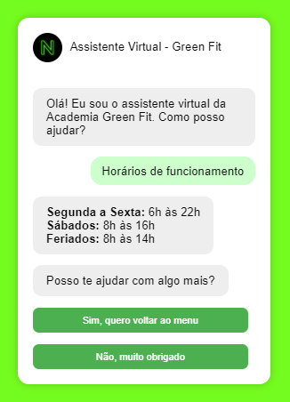
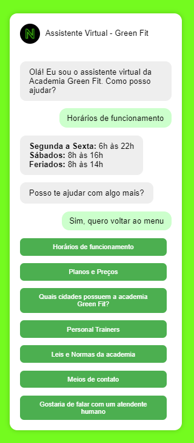
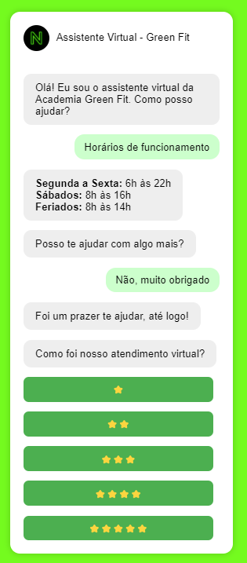
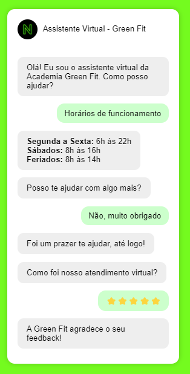

# 🤖 Chatbot (Chat Virtual)

Um chatbot feito para uma academia fictícia economizar tempo com perguntas que geralmente a maioria dos atendentes recebem. Desenvolvi este projeto com o objetivo de facilitar o esclarecimento de dúvidas comuns em uma academia, de modo que os funcionários não precisem se preocupar em responder repetidamente às mesmas perguntas, deixando assim, o setor de suporte ao cliente automatizado e eficiente.



## 🚀 Tecnologias

Este projeto foi desenvolvido com as seguintes tecnologias:

- **HTML** & **CSS** – Estrutura e estilo da interface
- **JavaScript** – Lógica do chatbot e manipulação dos botões de pergunta e resposta

## 💻 Projeto

O Chatbot é uma aplicação web que permite interações em tempo real com um assistente virtual com fluxo de perguntas e respostas programadas. O projeto oferece uma alternativa de automatizar o setor de suporte ao cliente de empresas, contribuindo com a economia de tempo no trabalho e oferecendo todo suporte necessário ao cliente.

### Características

- 💬 Chat em tempo real (usuário e bot)
- 🎨 Interface limpa
- 🚀 Performance otimizada
- 🛡️ Fluxo pré-selecionado

## ⚙️ Como Rodar o Projeto

```bash
# Clone o repositório
git clone https://github.com/henriquegsantanna/chatbot.git

# Entre no diretório
cd chatbot
```

## ⚙️ Resumo

- Tela inicial para dar início a conversa.


- Bot pergunta como pode ajudar e exibe, como botão, todas as opções do menu para o usuário selecionar.


- Usuário seleciona a opção, o bot responde e pergunta se pode ajudar em algo mais.


- Caso o usuário selecione que deseja voltar ao menu, novamente será exibido o menu com as opções.


- Caso o usuário selecione a opção "Não, muito obrigado", o bot agradece e solicita ao usuário uma avaliação para o atendimento (1 a 5 estrelas).


- Após o usuário avaliar, o bot agradece o feedback e a conversa é encerrada.


## 📫 Contato

- [GitHub](https://github.com/henriquegsantanna)
- [E-mail](henriquegsantanna@gmail.com)
- [LinkedIn](www.linkedin.com/in/henrique-gaiardoni-140b18314)